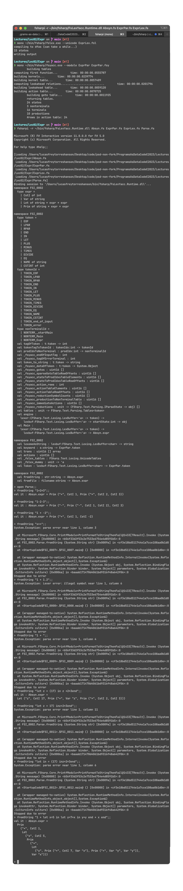

# programs-as-data

## Created by

fefa and luha

## Table of contents

<!--ts-->
* [Assignment 1](#assignment-1)
* [Assignment 2](#assignment-2)
  * [Exercise 2.4 from PLC](#exercise-24-from-plc)
  * [Exercise 2.5 from PLC](#exercise-25-from-plc)
  * [Exercise 3.2 from PLC](#exercise-32-from-plc)
  * [Exercise 2.1 from BCD](#exercise-21-from-bcd)
  * [Exercise 2.2 from BCD](#exercise-22-from-bcd)
* [Assignment 3](#assignment-3)
  * [Exercise 3.3](#exercise-33)
  * [Exercise 3.4](#exercise-34)
  * [Exercise 3.5](#exercise-35)
  * [Exercise 3.6](#exercise-36)
  * [Exercise 3.7](#exercise-37)
<!--te-->

## Assignment 1

Only changed Intcomp1.fs and Intro2.fs.
Also created the file SimpleExpr.java

## Assignment 2

### Exercise 2.4 from PLC

Changed three funtions in Intcomp.fs

```fsharp
let rec scomp (e : expr) (cenv : stackvalue list) : sinstr list =
    match e with
    | CstI i -> [SCstI i]
    | Var x  -> [SVar (getindex cenv (Bound x))]
    | Let (tup, ebody) ->
        let rec bindings b sinlst cenv' =
            match b with
            | [] -> sinlst, cenv'
            | (str, exp) :: tail ->
                bindings tail (scomp exp cenv' @ sinlst) (Bound str :: cenv')
        
        let sinstrs, newcenv = bindings tup [] cenv
        let sinstrs2 = scomp ebody newcenv
        sinstrs @ sinstrs2 @ [SSwap; SPop]
    | Prim("+", e1, e2) -> 
          scomp e1 cenv @ scomp e2 (Value :: cenv) @ [SAdd] 
    | Prim("-", e1, e2) -> 
          scomp e1 cenv @ scomp e2 (Value :: cenv) @ [SSub] 
    | Prim("*", e1, e2) -> 
          scomp e1 cenv @ scomp e2 (Value :: cenv) @ [SMul] 
    | Prim _ -> failwith "scomp: unknown operator";;

let sinstrToInt sn =
    match sn with
    | SCstI n -> [0; n]
    | SVar n -> [1; n]
    | SAdd -> [2]
    | SSub -> [3]
    | SMul -> [4]
    | SPop -> [5]
    | SSwap -> [6]

let rec assemble (sn: sinstr list) =
    let rec aux lst acc =
        match lst with
        | x :: tail -> aux tail (acc @ (sinstrToInt x))
        | _ -> acc
    aux sn []
```

### Exercise 2.5 from PLC

Changed Machine.java

```java
import java.io.File;
import java.io.FileNotFoundException;
import java.util.ArrayList;
import java.util.Scanner;

class Machine {

  final static int 
    SCST = 0, SVAR = 1, SADD = 2, SSUB = 3, SMUL = 4, SPOP = 5, SSWAP = 6;
  
  public static void main(String[] args) {
      ArrayList<Integer> listOfint = new ArrayList<Integer>();
      Scanner scanner;
      try {
            scanner = new Scanner(new File("../"+args[0]));
            while(scanner.hasNext()){
                  listOfint.add(scanner.nextInt());
            }
            int[] rpn3 = listOfint.stream().mapToInt(i -> i).toArray();
            System.out.println(seval(rpn3));
      } catch (FileNotFoundException e) {
            e.printStackTrace();
      }
  }
  
  static int seval(int[] code) {
    int[] stack = new int[1000]; // evaluation and env stack
    int sp = -1; // pointer to current stack top

    int pc = 0; // program counter
    int instr; // current instruction

    while (pc < code.length) 
      switch (instr = code[pc++]) {
      case SCST:
        stack[sp+1] = code[pc++]; sp++; break;
      case SVAR:
        stack[sp+1] = stack[sp-code[pc++]]; sp++; break;
      case SADD: 
        stack[sp-1] = stack[sp-1] + stack[sp]; sp--; break;
      case SSUB: 
        stack[sp-1] = stack[sp-1] - stack[sp]; sp--; break;
      case SMUL: 
        stack[sp-1] = stack[sp-1] * stack[sp]; sp--; break;
      case SPOP: 
        sp--; break;
      case SSWAP: 
        { 
            int tmp     = stack[sp]; 
            stack[sp]   = stack[sp-1]; 
            stack[sp-1] = tmp;
            break;
        }
      default:
        throw new RuntimeException("Illegal instruction " + instr 
            + " at address " + (pc-1));
      }
    return stack[sp];      
  }
}
```

### Exercise 3.2 from PLC

The regex for matching on a string containing `a` and `b` where there had to be an `b` between all `a`'s, could be:

```regex
^a?((b+)(a?))*$
```

NFA diagram


DFA diagram


### Exercise 2.1 from BCD

a. `^(0)*42$`
b. `^(?!0*42$)\d+$`
c. `^(0)*([4][3-9]|[5-9]\d|[1-9]\d{2,})$`

### Exercise 2.2 from BCD

Given the regex `a*(a|b)aa` we constructed the given NFA and DFA.

NFA

```regex
flowchart TD

ids((start))
id1((1))
id2((2))
id3((3))
id4((4))
id5((5))
ide(((end)))

ids -- ε --> id1
id1 -- a --> id2
id2 -- ε --> id1
id1 -- a --> id3
id1 -- b --> id3
id3 -- a --> id4
id4 -- a --> id5
id5 -- ε --> ide
```

DFA

```regex
flowchart TD

ids((start))
id1((1))
id2((2))
id3((3))
id4((4))
id5(((5)))
ide(((end)))

ids -- a --> id1
ids -- b --> id2
id1 -- a --> id3
id1 -- b --> id2
id2 -- a --> id4
id3 -- a --> id5
id3 -- b --> id2
id4 -- a --> ide
id5 -- a --> id5
id5 -- b --> id2
```

### hellolex

#### Question 1

What are the regular expressions involved, and which semantic values are they associated with?

The regex is `['0'-'9']` and can match a single  number between 0 and 9 inclusive.

#### Question 2

Generate the lexer out of the specification using a command prompt. Which additional file is generated during the process?

How many states are there by the automaton of the lexer? Hint: Depending on setup, you can generate the lexer with the command fslex --unicode hello.fsl from the command prompt. You can get the number of the states of the automaton by reading the report output when the lexer is generated.

## Assignment 3

### Exercise 3.3

Rightmost deriviation given `let z = (17) in z + 2 * 3 end EOF`

| rule | match |
| --- | --- |
| A | **Expr** EOF |
| F | LET NAME EQ Expr IN **Expr** END EOF |
| H | LET NAME EQ Expr IN Expr PLUS **Expr** END EOF |
| G | LET NAME EQ Expr IN Expr PLUS Expr TIMES **Expr** END EOF |
| C | LET NAME EQ Expr IN Expr PLUS **Expr** TIMES 3 END EOF |
| C | LET NAME EQ Expr IN **Expr** PLUS 2 TIMES 3 END EOF |
| B | LET NAME EQ **Expr** IN z PLUS 2 TIMES 3 END EOF |
| E | LET NAME EQ **(Expr)** IN z PLUS 2 TIMES 3 END EOF |
| C | LET NAME EQ 17 IN z PLUS 2 TIMES 3 END EOF |
| B | LET z EQ 17 IN z PLUS 2 TIMES 3 END EOF |

### Exercise 3.4


### Exercise 3.5



<details>

<summary> Commands to compile and run </summary>

```bash
mono ~/bin/fsharp/fslex.exe --unicode ExprLex.fsl
mono ~/bin/fsharp/fsyacc.exe --module ExprPar ExprPar.fsy
fsharpi -r ~/bin/fsharp/FsLexYacc.Runtime.dll Absyn.fs ExprPar.fs ExprLex.fs Parse.fs
```

</details>

### Exercise 3.6

Added the `compString` function to `Expr.fs`. The code can be seen in the file and also below:

```fsharp
let compString (str : string) : sinstr list =
    let e : expr = fromString str
    scomp e []
```

### Exercise 3.7

