# programs-as-data

## Created by

fefa and luha

## Assignment 1

Only changed Intcomp1.fs and Intro2.fs.
Also created the file SimpleExpr.java

## Assignment 2

### Exercise 3.2

The regex for matching on a string containing `a` and `b` where there had to be an `b` between all `a`'s, could be:

```regex
^a?((b+)(a?))*$
```

NFA diagram

```mermaid
stateDiagram-v2

[*] --> 1 : ε
1 --> 2 : a
1 --> 3 : b
2 --> 3 : b
3 --> 1 : ε
2 --> [*] : ε
3 --> [*] : ε
```


DFA diagram

